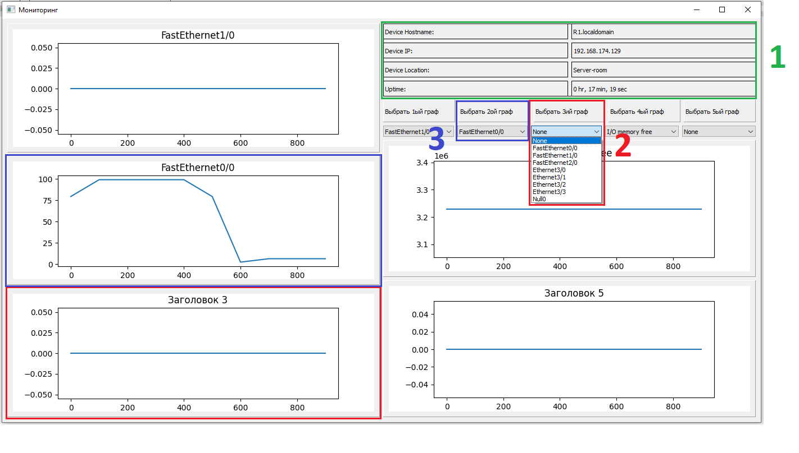

# Monitoring tool for Cisco devices
A remote monitoring system with GUI utitilising the Simple Network Management Protocol (SNMP) built with the PySNMP python library.

## Used libraries

- [PyQt5](https://pypi.org/project/PyQt5/#:~:text=PyQt5%20is%20a%20comprehensive%20set,including%20iOS%20and%20Android.)
- [Matplotlib](https://matplotlib.org/stable/users/getting_started/)
- [PySNMP](https://pysnmp.readthedocs.io/en/latest/)

## How to use 
1. Have libraries listed above installed.    
<code>$ pip install PyQt5</code>    
<code>$ pip install matplotlib</code>    
<code>$ pip install pysnmp</code>
2.  Start application using Bash or PowerShell locally: 
<code>$ python ./script.py</code>
3.  After start you will see a connection window, where:
	- (1) is where you enter an IP address of a Cisco device
	- (2) is where you enter SNMP-community string
	- (3) is a button to perform connection

4.  Afterwards, a monitoring window will present itself, containing:
	- (1) Basic information about device that you've connected to
	- (2) Drop-down list to choose what to monitor
	- (3) Images which will contain a dynamic graph of a selected device's characteristic, such as broadband load, cpu load, free processor memory, etc.

